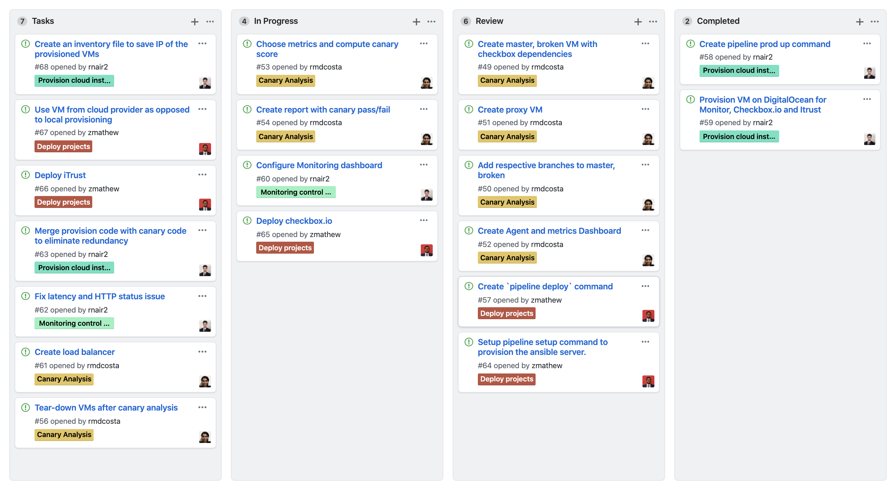

# Milestone 3 Checkpoint Report

## Project Board

For this checkpoint, the 3 general tasks were assigned as follows:

#### Provision cloud instances, monitoring control plane - Rohit

Completed the following tasks:

- Provision virtual machines on DigitalOcean for Monitoring dashboard, Checkbox.io and iTrust
- Configure the `pipeline prod up` command
- Configure the monitoring dashboard for DigitalOcean virtual machines

Remaining tasks:

- Fix the latency and HTTP status issue in the monitoring dashboard
- Merge the monitoring dashboard code with canary analysis to eliminate redundancy
- Create an inventory file containing the IP addresses of the provisioned VMs

#### Implement deployment to cloud instances - Zachariah

Completed the following tasks:

- Setup `pipline setup` to provision the ansible server
- Setup `pipeline deploy` to deploy the app on the server specified in the inventory file

Remaining tasks:

- Deploy the checkbox.io app
- Deploy the iTrust app
- Use a VM from cloud provider as opposed to local provisioning

#### Implement canary analysis (checkbox.io preview microservice) - Raveena

Completed the following tasks:

- Provisioned and configured monitor, blue and green
- Cloned the appropriate branches
- Setup and start agent
- Setup and run dashboard
- Metrics: CPU, Memory, Latency, HHTPStatus

Remaining tasks:

- Finalise metrics
- Create report
- Setup and run loadbalancer
